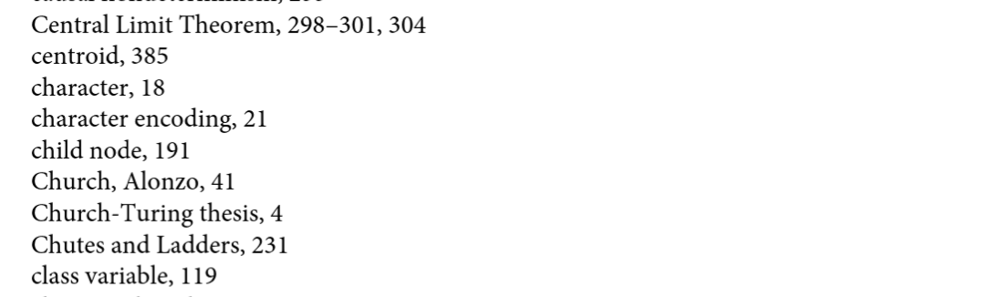

# Task 2. Re-implement the search method for `StreamingService`

## Background

In problem set 8 and 9, we require the user to provide the exact title of the show in order to be able to get the show / show details. In reality, however, we do not search in this way. Think about how you search on Google or Netflix. First, the case of the words should not matter. Second, often we do not use the whole name to search for a show. For example, for the show `"The Queen's Gambit"`, user may just type the relatively distinctive word `"gambit"`. Thirdly, we may even search a show just based on some features. For example, user may just type `"chess"` (what the show is about) or `"Anya"` (the main actress) when searching the show. Fourth, user may not even spell the words correctly (!). Also, as the search is no longer exact, it is likely that the search engine will return multiple possible results (rather than just one) and often the result is sorted by based on some criteria (e.g. by relevance, popularity of the show or the watch history).

While the first point is easy to address, the second and the third one requires some more work. Essentially, it is not enough to just perform a simple string comparison or use the title of the show as a key (if `dict` is used). A possible (but naive) way to address the second and the third points is to look at the details of each show and see if there is any match. Such way, however, is not efficient as it is a brute force search. The fourth point is even more troublesome and we are not going to handle it in this project.

In this part of the project, we are going to build a "smarter" search engine for `StreamingService` with the use of:
1. _Inverted index_
2. _Natural language processing_
3. Search with multiple keywords

Below we provide further details of each of the elements. Note that while we show you how to modify the search engine in 3 steps, you can do it in one go. For example, you can do the natural language processing _while_ you are creating the index, rather than creating the index and then improving it with natural language processing.

---

### Step 1. build an inverted index

[Inverted index](https://en.wikipedia.org/wiki/Inverted_index) (or "index" for short) maps word/term to its location. An index for a search engine is similar to the index of words in the back of book like the following:

<center></center>

For example, the index here tells you that you can find the content related to/mentioning the term "class variable" on p.119 of the book. For book indexing, the words are also sorted in alphabetical order so we can search where the word of interest is in the index easily.

Below we show you an _overly simplified_ example of an index, with the use of the Netflix show data for illustrative purpose. For simplicity, we assume we only have 2 shows: `"The Queen's Gambit"` and `"Magnus"`. We further assume we only use "description" and the "title" of the shows to build the indexing.

The data we consider in this _overly simplified_ example is:

|        | show 1              | show 2  |
|--------|---------------------|---------|
| Title  | The Queen's Gambit  | Magnus  |
| Description | In a 1950s orphanage, a young girl reveals an astonishing talent for chess and begins an unlikely journey to stardom while grappling with addiction | This dramatic documentary explores the life and mind of Magnus Carlsen, the charismatic Norwegian prodigy who became world chess champion |

Now we build the index mapping the terms to the location of the show. For simplicity we assume the location for `The Queen's Gambit` is 1 and 2 for `Magnus`. With the given data, the index should look like the following:

| terms    | location |
|----------|----------|
| the      | 1        |
| queen's  | 1        |
| gambit   | 1        |
| in       | 1        |
| a        | 1        |
| 1950s    | 1        |
| ...      | ...      |
| chess    | 1, 2     |
| and      | 1, 2     |
| begins   | 1        |
| ...      | ...      |
| magnus   | 2        |
| this     | 2        |
| dramatic | 2        |
| ...      | ...      |
| champion | 2        |

Note:
* Everything has converted into lowercase with punctuation at the front or back of the words removed for more convenient comparison later
* You do NOT need to have the "location" to be some numerical number - you have the freedom to choose how to represent the location of the show.

After such index is built, we can use it to provide search results quickly. For example, if the user searches `"Gambit"`, the search engine then just looks up the term `"gambit"` (as case of the term does not matter) from the table and finds the location of the show is 1. It therefore returns the show `"The Queen's Gambit"` (type: `Show`). If the user searches `"norwegian"`, then it returns the show `"Magnus"`. If the user searches `"chess"`, then it should return both `"The Queen's Gambit"` and `"Magnus"`.

As the first step, do the following:

1. Write a function/method to build an index based on the given show information. The function/method returns a container that store the index. You should choose an appropriate container to store the index. You may want to store the locations of the show corresponding to a given term using [`set`](https://docs.python.org/3/library/stdtypes.html#set), as the order of the location (e.g. locations `1`, `2` or `2`, `1` for `"chess"`) does not matter and using `set` will make step 3 easier to implement. Please handle the case and the punctuations, as demonstrated in the example above
2. Modify the class `StreamService` so that
  * It has the index for all the shows
  * The `search` method now uses the index for searching. For simplicity, for now we assume user will only use one term to search (e.g. `"Gambit"` but not `"Queen's Gambit"`). Also, it should now return all the shows that contain the given term (instead of just returning one show) in a collection of `Show` (e.g. a `list` of `Show`). Make sure to take care of the case and the punctuations of the user input as well

Think carefully when the indexing should be done. Should it be done at the beginning when we create an instance of `StreamingService`? Or should it be done when searching? While the simplified example above we build the index by only considering the title and the description of the shows, you should at least include the information from "title", "description" and "cast". Feel free to add any information you think is useful to help users to find the right show.

---

## Step 2. Natural language processing

While the index above is helpful, it is still not very realistic. For example you should expect that whether a user searches with term `Queen's` or `Queen` should not matter, so as `begins` or `begin`. Moreover some stop words like `a` is just not useful for the search. Therefore, in this step we are going to improve the search engine by removing the stop words and _stemming_ the terms with _natural language processing_ so that we can handle the problems stated above.

Please read the file [nlp.md](nlp.md) to learn about natural language processing (NLP) and how we can do NLP in Python.

As the second step, do the following:
1. Rewrite the index function so that the terms used in the index are now stemmed and do not include the stop words. Continuing with the example above, the index should look something like this:

| terms    | location |
|----------|----------|
| queen    | 1        |
| gambit   | 1        |
| 1950     | 1        |
| ...      | ...      |
| chess    | 1, 2     |
| begin    | 1        |
| ...      | ...      |
| magnu    | 2        |
| dramat   | 2        |
| ...      | ...      |
| champion | 2        |

Note the result varies depending on what information you are using to build the index and also which stemmer to use. For example, for the string `'1950s'` `nltk.stem.porter.PorterStemmer` returns `'1950'` whereas  `nltk.stem.SnowballStemmer` returns `'1950s'`

2. Rewrite the `search` method in `StreamingService` so that now it uses the new index for searching. You also need to do the stemming on the user input. For example, if the user input is `"Queen's"`, then you should stem it to `queen` and then use it to look up the location from the index. For the input `"Queen's"`, your result should look something like this:
```
'A Christmas Prince: The Royal Baby',
'A Queen Is Born',
...
'The Queen of Flow',
"The Queen's Gambit",
...
```

Note:
* For readability, the search result shown here only has the title name, but your method should return a collection of `Show`, not `string`.

---

## Step 3.

Now our search engine is "smarter", but it is still quite different from the behaviour of search engine that we use. In reality, users usually provide more than one term to search. For example, if a user want to search `"The Queen's Gambit"`, he/she is likely to provide something like `"chess Anya"` instead of just one term like `"chess"`. Therefore, we will update our search engine so that users can use multiple terms to search.

Do the following:
1. Rewrite the `search` method in `StreamingService` so that now it takes a `string` that can have multiple terms in it. For example, it can take `"chess Anya"` as the input and break it down into two terms `"chess"` and `"Anya"`. The search method will then return the shows for which _all_ the terms are matched. For example, for `"chess Anya"`, the `search` method should return only one show `"The Queen's Gambit"`. This is because for the term `"chess"` we get:
```
'Magnus',
'Searching for Bobby Fischer',
'The Coldest Game',
"The Queen's Gambit"
```

and for `"anya"`, we have:
```
"Angela's Christmas",
"Angela's Christmas Wish",
'Barry',
'Creeped Out',
'Making The Witcher',
'Raja Rasoi Aur Anya Kahaniyan',
'The Dark Crystal: Age of Resistance',
"The Queen's Gambit",
'The Witch',
'The Witcher',
'The Witcher: A Look Inside the Episodes'
```

The only show that appears in both search results is `"The Queen's Gambit"`.

Note:
* For readability, the search results shown here only have the title name, but your method should return a collection of `Show`, not `string`.

Hint:
* You may find `set.intersection` useful.

---

## Things to show in the report

* Explain the decision you have made for the program design - for example, explain what you are including to build the index
* Create an instance `netflix` from `StreamingService`. Do some searches with it to show how the `search` method works. You may want to include the searches for which the search results are good and also when the search results are not very good.

---

## Optional features

You may consider including the following:
* Use Big O to explain why indexing is more efficient than the brute force search
* Update the `add a new show` method so that the index will be updated when new shows are added
* Modify the `search` method so that it will only return the shows that are suitable for the user based on age. To learn about the rating system, see [here](https://en.wikipedia.org/wiki/TV_Parental_Guidelines). In order to be able to access user's age, the `search` method should take `User` as input
* Modify the `search` method so that it can return some result with _partial match_. For example, if the search is `'chess Anya Elizabeth Harmon'`, it can for example return `'Creeped Out'` and  `"The Queen's Gambit"` as both matches 2 out of 3 of the terms to search.
* Sort the searching result by some criteria. Here are some possible ways:
  * Sort the search result based on user's history. In order to be able to access user's history, the `search` method should take `User` as input
  * Sort the search result based on the percentage of the terms in the title / description is matched
  * Sort the search result based on the rating of the show. One possible source of rating is [IMDb](https://www.imdb.com/interfaces/). Note that the data is in "tsv" for format. In order to load the data correctly via `Pandas`, you need to provide the optional argument `sep = '\t'` to `pd.read_csv()`
  * Any sensible ways to sort or any combination of different sorting criteria

Note optional means optional - you do NOT need to implement any of them to get a high mark. If you aim at a very high mark (e.g. > 85), then you may consider including some of them in your project.
